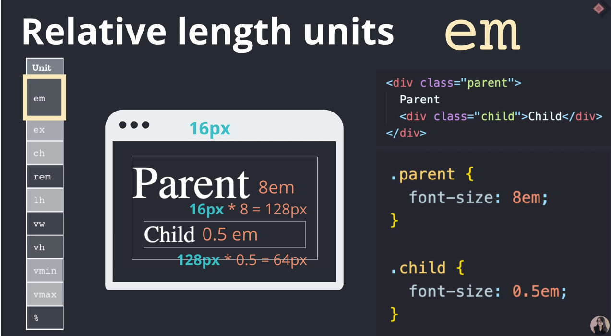
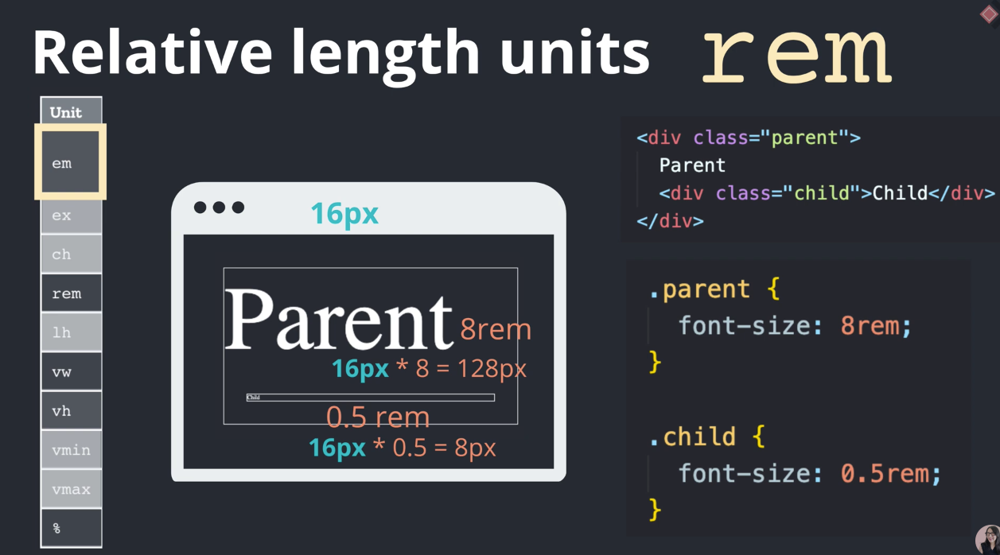
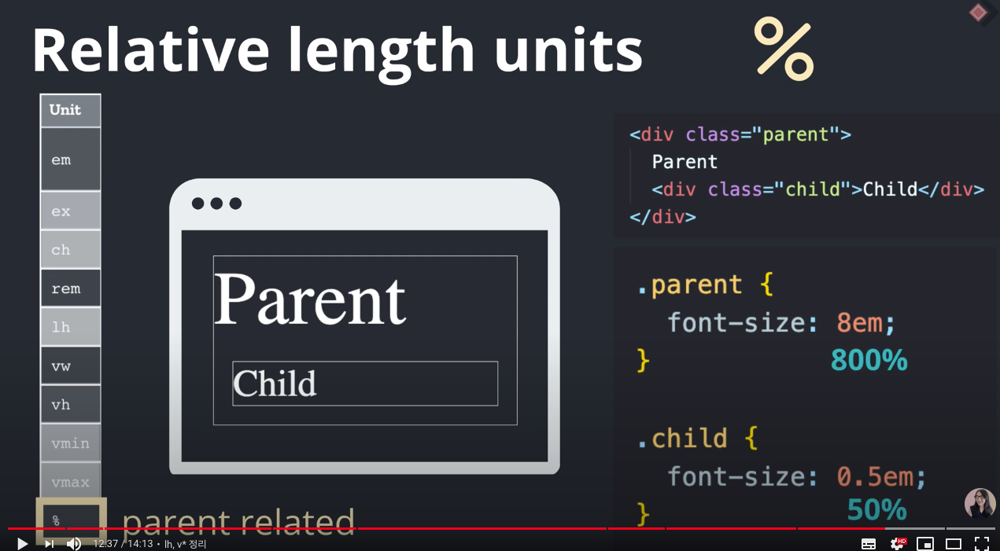

## Youtube

### 프론트엔드 필수 반응형 CSS 단위

Absolute vs Relative

### Absoulte
1. px 
- 우리가 아는 px

### Relative

- html 태그에 font-size : 100%를 해줘야 한다!!
1. em
 
- relative to parent element
  

2. rem
 
- relative to root element
  

3. vw, vh
- viewport related

4. %
- parent related

