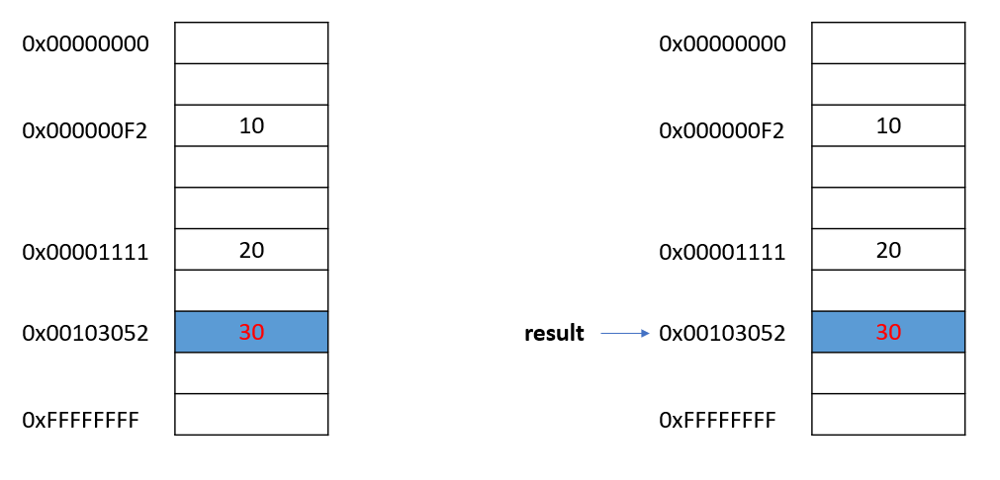
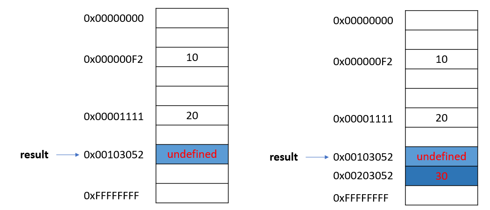
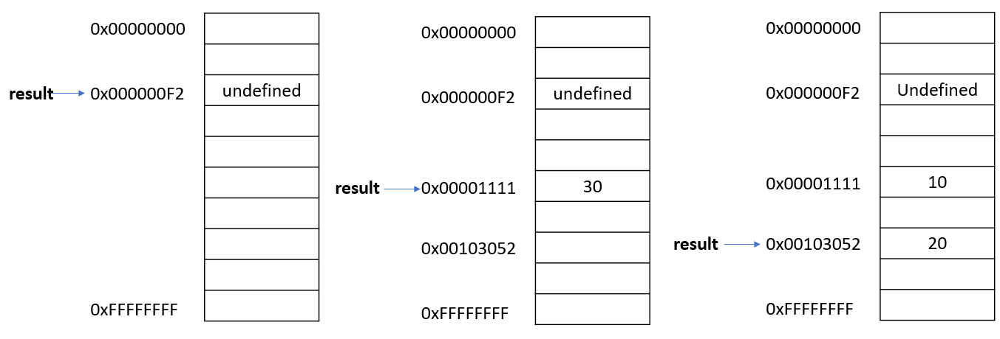
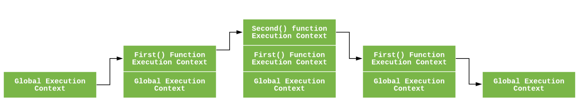

# 4장 변수

---

```js
var result = 10 + 20;
```

---
# 변수
```js
var result = 10 + 20;
```


---

## 변수(식별자)는 값이 아니라 메모리 주소를 기억하고 있다.

---

# 변수 선언과 값의 할당

```js
var result = 10 + 20;
```


```js
var result; // 변수 선언
result = 10 + 20; // 값의 할당
```

---


# 변수 선언과 값의 할당

```js
var result; // 변수 선언
result = 10 + 20; // 값의 할당
```


---

# Hoisting
JavaScript Hoisting refers to the process whereby the compiler allocates memory for variable and function declarations prior to execution of the code
=> 코드 실행 전에 컴파일러가 변수와 함수 선언을 위한 메모리 할당을 한다

---

# Hoisting
## 평과 과정과 실행 과정

```js
var result; // 변수 선언 => 평가 과정
result = 10 + 20; // 값의 할당 => 실행 과정
```
---

# Hoisting

```js
console.log(result); // undefined

var result = 10 + 20;

console.log(result); // 30;
```
---

# 값의 재활당
```js
var result = 30;
result = 40;
```


---

## Mutable
objects, arrays
```js
var objectTest = {a : 1};
objetTest.a = 2;

var arrayTest = [0,2,3];
arrayTest[0] = 10;
```
## Immutable
else
- performance
- reduce memory use
- thread-safety

---

# Further

---

# let, const
```js
var result;
```
block-level scope 대신 function-level scope를 지원하여 부작용 발생


```js
let result;
const result;
```
ECMAScript6(ES6)에서 새로 추가

---

# Execution Context


stack에 context를 push 하고 pop된 context를 실행 합니다.


---

# Garbage collector

- 메모리 할당을 모니터링 하고 더이상 필요하지 않으면 할당 해제
- 메모리가 필요한지 여부 판단이 100프로 정확하지 않다.