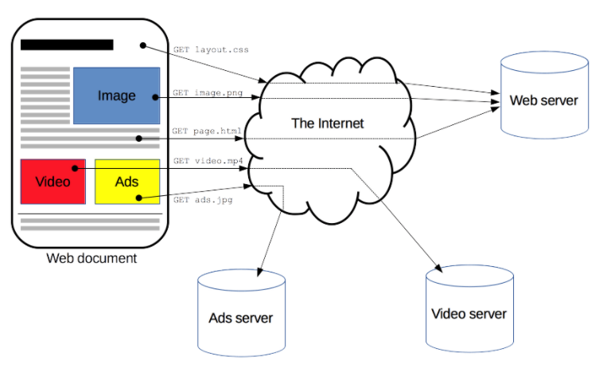

# An overview of HTTP
http는 HTML doc 같은 자원을 fetch 할 수 있게 해주는 프로토콜이다. HTTP는 Web 위에서 data exchange의 기초이며 HTTP는 client-server protocol이다. client-server protocol은 대개 Web brower같은 recipient에 의해서 초기하되는 request를 의미한다. complete document는 fetch된 다른 sub-document로 recontructe된다. sub-document의 예는 text, layout description, images, video, script 등등이 있다.

# reference
https://developer.mozilla.org/en-US/docs/Web/HTTP/Overview