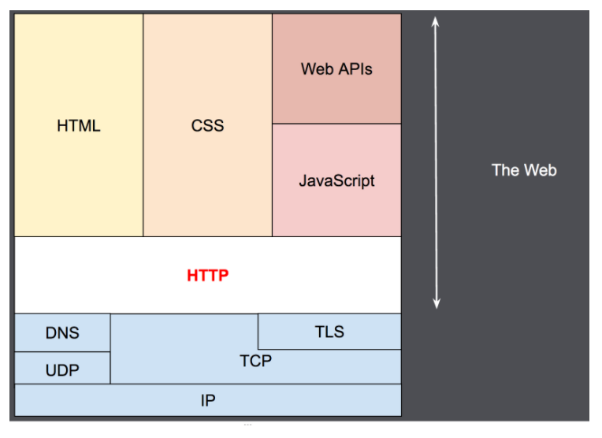
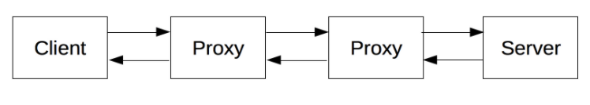

# An overview of HTTP
http는 HTML doc 같은 자원을 fetch 할 수 있게 해주는 프로토콜이다. HTTP는 Web 위에서 data exchange의 기초이며 HTTP는 client-server protocol이다. client-server protocol은 대개 Web brower같은 recipient에 의해서 초기하되는 request를 의미한다. complete document는 fetch된 다른 sub-document로 recontructe된다. sub-document의 예는 text, layout description, images, video, script 등등이 있다.

Client와 서버는 각각의 message를 교환하여 통신한다. client(주로 web browser)에서 보내지는 메시지는 request라고 불리며 서버에서 보내지는 메시지는 response라고 불린다.

1990년도 초에 디자인된 HTTP는 extensible protocol 이다. HTTP는 TCP 또는 TLS-encrypted TCP connection 또는 reliable한 transport protocol를 통해서 보내지는 appliation layer protocol이다. 이와같은 extensibility 때문에 http는 hypertext document뿐 아니라 image와 video 또는 post content도 fetch할 수 있다. HTTP는 Web page 업데이트가 있는 언제든 document의 부분을 fetch 할 수 있다.

## Components of HTTP-based systems
HTTP는 client-server protocol 이다. 하나의 entity(user agent 도는 proxy)에서 request가 전송된다. 대부분 user-agent는 web browser이다. 그러나 어떤 것이든 될 수 있다.

각각의 request는 server로 전송된다. 서버는 request를 처리하고 response를 제공한다. client와 server 사이에 엄청 많은 entities가 존재하며 proxies라고 부른다. proxy는 다른 operation을 형성하고 gateway나 cache같이 행동한다. 예를들면

현실에서 browser와 server 사이에는 많은 컴퓨터가 있다. router, modem 등등. web의 layered design 때문에 이것들은 network와 transport layers에서 숨겨져 있다. HTTP는 가장 상위 layer, application layer이다. 비록 network 문제를 진단하는게 중요하더라고 하위 layer는 HTTP와 큰 관계가 없다.

### Client: the user-agent

# reference
https://developer.mozilla.org/en-US/docs/Web/HTTP/Overview