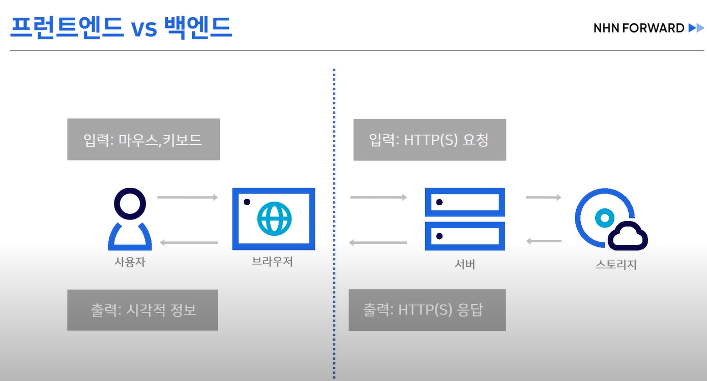

https://www.youtube.com/watch?v=q9d631Nl0_4

## 프롤로그
- 내가 작성하는 테스트가 나에게 도움을 주고 있는 걸까?
- 프론트엔드 테스트는 무엇을 어떻게 테스트해야 하는  걸까?

## 목차
시각적 테스트 VS 기능적 테스트
단위 테스트 VS 통합 테스트

## 개발자가 왜 테스트를 작성해야 할까요?
confidence

## 프론트엔드 vs 백엔드
테스트는 input과 output을 검증하는 것이다.

## 프론트엔드의 입력과 출력

### 입력 데이터
DOM 이벤트 : 마우스, 키보드, 터치 등의 입력 이벤트
- 브라우저 이벤트 시뮬레이션 API 사용

라우팅/IO : URL 변경, 네트워크/로컬 파일, 로컬 스토리지/쿠키
- 브라우저 API 목킹 / E2E 테스트 도구 사용

### 출력 데이터
코드 관점 : HTML, CSS
- 검증 : 생성된 HTML, CSS 코드의 내용을 비교

사용자 관점 : 브라우저가 렌더링한 화면(픽셀 정보)
- 검증 : 브라우저가 렌더링한화면을 갭처해서 이미지로 비교

## 스냅샷 테스트

## HTML 비교의 문제점
테스트가  나에게 신뢰를 주는가?

구현 상세 테스트 vs 동작 테스트

## 시각적 회귀 테스트의 문제점

## 시각적 테스트 전문 도구
- applitools
- percy
- chromatic